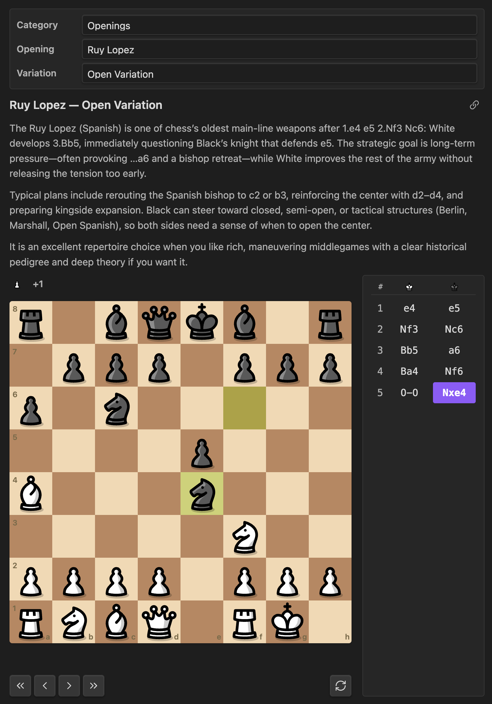
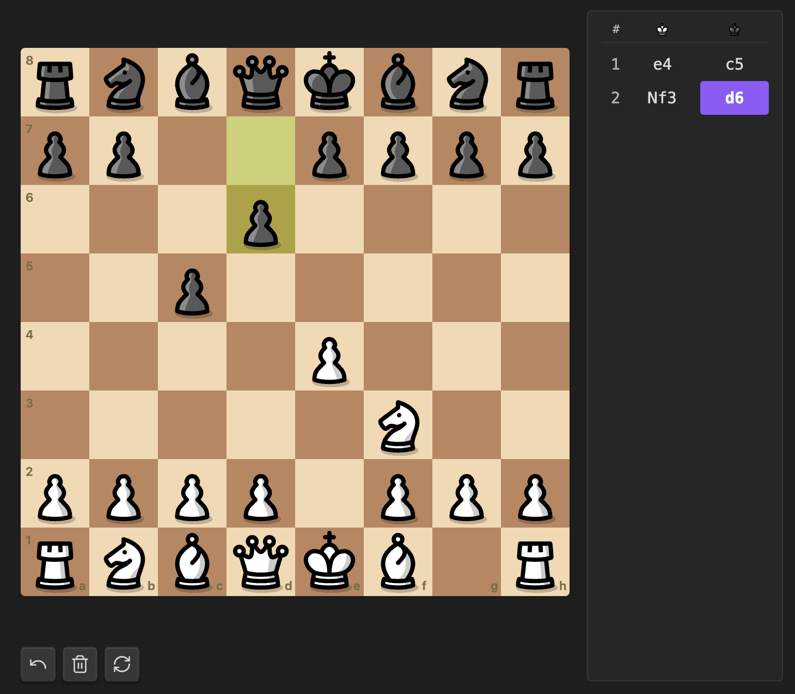

# Caissa

A chess study plugin for [Obsidian](https://obsidian.md): embed positions, study openings and endgames, browse World Championship games, and annotate PGNs inside your notes. Named after [Caïssa](https://en.wikipedia.org/wiki/Caïssa), the muse of chess.

- Pick from a built-in library of openings and variations (Sicilian → Dragon, Najdorf, Yugoslav…)
- Play any position **against Stockfish** with adjustable strength (level 0–20) — fully offline, click-to-move, with promotion/undo/new-game controls
- Study **canonical endgame techniques** — basic mates, Lucena, Philidor, Vancura, opposition, wrong-bishop draw, and more
- Browse **bundled World Championship games** — 68 hand-picked decisive/famous games from 1886 (Steinitz–Zukertort) through 2024 (Gukesh–Ding)
- Paste a **PGN from anywhere** (Lichess, chess.com, ChessBase, your own play) and play through it with full headers
- Pull a Lichess game directly with `lichess: <url>` — no token needed
- Step through moves with `prev`/`next` controls or click any move in the list
- Drop multiple boards in the same note to compare variations side by side
- Two-column white/black move list right next to the board
- 7 piece styles to choose from — classic, modern, retro, and more (see [Piece sets](#piece-sets))
- Optional **Opening Explorer** panel showing win/draw/loss percentages for every candidate next move (powered by [Lichess](https://lichess.org), opt-in)

## Contents

- [Quick start](#quick-start)
- [Screenshots](#screenshots)
- [Usage](#usage) — [Inline picker](#inline-picker), [Sizing and layout](#sizing-and-layout), [Loading whole games](#loading-whole-games), [Built-in openings](#built-in-openings), [Endgames](#endgames), [World Championship games](#world-championship-games), [Piece sets](#piece-sets)
- [Commands](#commands)
- [Export a board as PNG or SVG](#export-a-board-as-png-or-svg)
- [Captured pieces and material balance](#captured-pieces-and-material-balance)
- [Annotations: arrows and square highlights](#annotations-arrows-and-square-highlights)
- [Keyboard shortcuts](#keyboard-shortcuts)
- [Engine analysis (Stockfish, offline)](#engine-analysis-stockfish-offline)
- [Play against Stockfish](#play-against-stockfish)
- [Opening Explorer (win / draw / loss bars)](#opening-explorer-win--draw--loss-bars)
- [Block options reference](#block-options-reference) — every key you can put in a `chess` block
- [Settings](#settings)
- [Development](#development)
- [Credits](#credits)

## Quick start

If you only read three examples, read these. Each is a complete, self-contained block — paste it into any note and it just works.

**1. Pull up a known opening:**

````markdown
```chess
opening: Sicilian Defense
variation: Dragon
```
````

**2. Drop in a PGN you copied from anywhere:**

````markdown
```chess
[White "Carlsen, Magnus"]
[Black "Nakamura, Hikaru"]
[Result "1-0"]

1. e4 e5 2. Nf3 Nf6 3. Nxe5 d6 4. Nf3 Nxe4 ...
```
````

**3. Play a real game against Stockfish from any starting position:**

````markdown
```chess
opening: Italian Game
play: white
level: 5
```
````

That's the whole mental model: every block is a starting position plus optional behavior. See [Block options reference](#block-options-reference) for every key you can use, or keep reading for guided examples.

## Screenshots

Images live in [`assets/`](assets/) (same paths work on GitHub and in Obsidian’s Markdown preview when the README is opened from the vault).

### Opening study

A built-in opening with the two-column move list and board layout:



### Free board

Blank board mode: both colors are human, moves persist in the block as `moves:` / `freeboard:`:



## Usage

Add a fenced code block with the language `chess`:

````markdown
```chess
opening: Sicilian Defense
variation: Dragon
```
````

That renders the full Dragon line with a board, an interactive move list, and step controls. Anything you can put in a code block is supported, so you can have several variations stacked in the same note:

````markdown
## Sicilian Defense

### Najdorf

```chess
opening: Sicilian Defense
variation: Najdorf
```

### Dragon

```chess
opening: Sicilian Defense
variation: Dragon
title: My Dragon notes
```

### Yugoslav Attack against the Dragon

```chess
opening: Sicilian Defense
variation: Yugoslav Attack
```
````

### Inline picker

Don't want to look up slugs? Drop a blank `chess` block — either the **Insert chess board** command or just type the fences yourself:

````markdown
```chess
```
````

The rendered block grows a little dropdown strip across the top: pick a category (Openings, Endgames, World Championship), then a specific opening/variation/endgame/game from a second dropdown. Your selection is written back into the block's source as `opening: …` / `variation: …` / `endgame: …` / `wccgame: …`, so the result is the same as if you'd typed it by hand — and it survives reload, sync, and copy-paste.

This is the friendliest way to use the plugin if you don't already have a position in mind.

> See [Block options reference](#block-options-reference) for every key you can put in a `chess` block.

### Sizing and layout

```chess
opening: Sicilian Defense
variation: Dragon
size: large       # small | medium (default) | large | full
showMoves: true   # set false to hide the right-hand move list
interactive: false  # set false to hide the prev/next/flip buttons
```

- `small` ≈ 240px board, `medium` ≈ 360px (default), `large` ≈ 500px.
- `size: full` makes the board fill the writing area's width and pushes the move list below it.
- The board's column also auto-collapses to a single stacked layout when the writing pane is narrower than ~520px (mobile screens, narrow split-pane editing). This uses CSS container queries so it responds to the *pane* width, not the whole window.
- `showMoves: false` lets the board take the row by itself without an empty side column.

If both `opening` and `moves` are provided, `moves` wins (handy for adding extra moves past the book). If `pgn` or `lichess` is set, those win over everything else (they bring their own moves and headers).

#### Pick the position to show on first render

By default a block opens at the starting position (move 0) so you can step through. If you'd rather land on a specific move — to highlight a critical position, jump straight to a tactic, or open a long PGN at the interesting middlegame — use `startMove`:

````markdown
```chess
opening: Sicilian Defense
variation: Najdorf
startMove: 12
```
````

`startMove` is a 0-indexed step into the move list (`0` = starting position, `1` = after White's first move, `2` = after Black's first reply, and so on). Out-of-range values clamp to the last move, so `startMove: 999` on a 30-move game just opens at the end. Stepping with `←`/`→` works normally from there — it's purely the initial render position, not a hard limit.

### Loading whole games

#### Paste a PGN

If the entire body of the block looks like a PGN — that is, it starts with a `[Tag "value"]` header, or contains move tokens with no `key: value` lines — the plugin treats the whole block as a PGN. No `pgn:` prefix needed:

````markdown
```chess
[Event "Norway Chess"]
[Site "Stavanger NOR"]
[Date "2024.05.27"]
[White "Carlsen, Magnus"]
[Black "Nakamura, Hikaru"]
[Result "1-0"]
[WhiteElo "2830"]
[BlackElo "2789"]
[ECO "C42"]
[Opening "Russian Game"]

1. e4 e5 2. Nf3 Nf6 3. Nxe5 d6 4. Nf3 Nxe4 5. d4 d5 6. Bd3 Bd6 ...
```
````

The plugin renders a clean game-info strip above the board (players · result · event · date · ECO/opening), strips any `{ [%eval ...] [%clk ...] }` annotations, and walks the mainline. Variations and comments are dropped.

PGNs from Lichess, chess.com (Share → PGN), ChessBase, SCID, and the Lichess `pgn-extract` tool all paste cleanly.

#### Pull a Lichess game by URL

If you'd rather just point at a Lichess game, use the `lichess` key:

````markdown
```chess
lichess: https://lichess.org/q7ZvsdUF
```
````

A bare game ID also works (`lichess: q7ZvsdUF`). The plugin fetches the PGN from `https://lichess.org/game/export/<id>` over HTTPS — **no token required for this endpoint**, unlike the Opening Explorer. Results are cached in memory for the session.

You can combine `lichess:` with sizing/orientation keys:

````markdown
```chess
lichess: https://lichess.org/q7ZvsdUF
size: full
orientation: black
```
````

### Built-in openings

Italian Game · Ruy Lopez · Sicilian Defense (Najdorf, Dragon, Yugoslav, Accelerated Dragon, Scheveningen, Sveshnikov, Taimanov, Kan, Classical, Closed, Alapin, Smith-Morra) · French Defense · Caro-Kann · Scandinavian · Pirc · Alekhine's · Queen's Gambit (QGA, QGD, Slav, Semi-Slav, Tarrasch, Albin) · King's Indian · Nimzo-Indian · Grünfeld · English · Réti · London System.

Use the **Insert chess opening from library** command (Cmd/Ctrl+P) to fuzzy-search and insert a block for any of them.

### Endgames

The plugin ships ten canonical endgame techniques. Use them with `endgame: <slug>`:

| Slug | Topic | Demo line? |
| --- | --- | --- |
| `kqk-mate` | King + queen vs king (basic queen mate) | full technique, mate in 8 |
| `krk-mate` | King + rook vs king (basic rook mate) | full technique, mate in 4 |
| `krrk-ladder-mate` | Two rooks vs king (ladder mate) | mate in 2 |
| `kbnk-mate` | Bishop + knight mate (the W-manoeuvre) | Karttunen vs Rasik 2003, mate in 23 |
| `kbbk-mate` | Two bishops mate | Leslie-Hurd 2005 tablebase, mate in 19 |
| `lucena` | Lucena position — winning the rook endgame with the bridge | study position |
| `philidor` | Philidor position — drawing the rook endgame | study position |
| `vancura` | Vancura position — rook + a-pawn draw | study position |
| `kpk-opposition` | King + pawn vs king — opposition and key squares | study position |
| `wrong-bishop` | Wrong-colored bishop + rook-pawn draw | study position |

All five mating endgames ship a verified mating sequence you can step through with **next**. KQK, KRK, and the two-rook ladder use hand-crafted demo lines from a central starting position. For the two hardest mates we ship real games that were actually played out: **KBNK** uses the ending of Karttunen vs Rasik (European Club Cup 2003), picked up at move 84 with 23 moves of W-manoeuvre to mate; **KBBK** uses Joe Leslie-Hurd's 2005 tablebase analysis of the longest forced KBBK mate, with both sides playing perfectly to mate-in-19. The five non-mating positions (Lucena, Philidor, Vancura, K+P opposition, wrong-bishop) are study positions where the technique itself depends on best play from both sides, so the plugin lets you explore them without forcing a fixed line.

Example:

````markdown
```chess
endgame: lucena
```
````

Use the **Insert chess endgame from library** command for a fuzzy picker.

### World Championship games

The plugin ships 68 hand-picked World Championship games covering 20 matches from 1886 (Steinitz–Zukertort) through 2024 (Gukesh–Ding). Each is referenced by a stable slug formatted `<year>-<player1>-<player2>-<game>`:

````markdown
```chess
wccgame: 1972-fischer-spassky-06
```
````

That renders Fischer's famous game 6 against Spassky from Reykjavik with full headers, the result, the ECO code, and a clickable move list.

Use the **Insert chess world championship game** command for a two-step picker (match → game). PGNs are sourced from [PGN Mentor](https://pgnmentor.com/) and bundled inline with the plugin — no network calls at runtime.

To curate or extend the bundled set, edit `scripts/wcc-curated.json` and re-run `node scripts/fetch-wcc-games.mjs`.

### Piece sets

Set the global default in **Settings → Community plugins → Caissa → Piece set**, or override per board with `pieces: <name>`.

| Name | Style |
| --- | --- |
| `cburnett` | Classic Lichess look (default) — neutral, recognizable |
| `merida` | Traditional chess-club style, slightly heavier than cburnett |
| `staunty` | Modern bold Staunton tournament look |
| `caliente` | Warm modern Staunton with subtle gradient shading |
| `pixel` | 8-bit retro pixel art |
| `letter` | Just K Q R B N P text — high contrast, accessibility-friendly |
| `unicode` | Unicode chess characters from your system font |

## Commands

- **Insert chess board** — drops an empty `chess` code block at the cursor.
- **Insert chess opening from library** — fuzzy-search modal for openings and variations.
- **Insert chess endgame from library** — fuzzy-search the bundled endgame techniques.
- **Insert chess world championship game** — two-step picker (match → game) over the bundled WCC corpus.
- **Insert chess board from clipboard fen** — reads a FEN string from the clipboard and seeds a block.
- **Insert chess game from clipboard pgn** — reads PGN text from the clipboard and drops it into a `chess` block.
- **Insert chess game from lichess link** — reads a Lichess game URL or ID from the clipboard and inserts a `lichess: <id>` block.
- **Start openings quiz** — opens a modal that endlessly serves up positions from the bundled opening repertoire and asks for the next book move. Move spelling variants (`Nf3` vs `Ngf3`) are normalized via chess.js so anything legal counts. Tracks correct/total and a streak per session.

Or, drop a blank `chess` block (the **Insert chess board** command) and use the inline picker — a category dropdown lets you switch between Openings, Endgames, and World Championship right inside the rendered block, without typing slugs.

## Export a board as PNG or SVG

Right-click any rendered board (long-press on touch) for a context menu with:

- **Copy as image** — places a PNG on the system clipboard, ready to paste into Discord, Twitter, Obsidian notes, etc.
- **Copy as SVG** — places the SVG markup on the clipboard.
- **Save as PNG** — downloads a `caissa-board-<position>.png` file at 2× resolution (720×720 by default).
- **Save as SVG** — downloads a `caissa-board-<position>.svg` file.

Exports always reflect the *current* position on screen (after stepping moves or flipping), and use whichever piece set / colors / annotations you've configured for the block — what you see is what you copy.

## Captured pieces and material balance

Every board automatically shows a captured-pieces tray above and below it, plus a `+N` material badge next to the side that's ahead. The piece glyphs use whichever piece set is active for the board so the tray always matches.

- Pieces captured by White appear on White's side (bottom of the board by default; top if you flip with `F`).
- Pieces captured by Black appear on Black's side.
- The `+N` badge shows pawn-equivalent material — promotions are accounted for, so a queened pawn shows as `+8` rather than `+1` once it promotes.
- Trays auto-hide on positions where nothing has been captured (a fresh starting position, an endgame study with no captures), so they never add empty space.

You can hide the trays globally in **Settings → Caissa → Show captured pieces**, or per-block with `captured: false`.

## Annotations: arrows and square highlights

Annotate any board with arrows (move suggestions, threats, plans) and square highlights (key squares, weak squares, mating nets). Both are declarative — no clicks involved — so they survive note round-trips and look the same on every device.

````markdown
```chess
fen: r1bqkbnr/pppp1ppp/2n5/4p3/4P3/5N2/PPPP1PPP/RNBQKB1R w KQkq - 2 3
arrows: f3e5 g1f3-blue
highlights: e5 f7-red
```
````

Token grammar:

- `arrows: <from><to>[-color]` — list of square pairs, whitespace-separated. `e2e4 g1f3 d2d4-blue`.
- `highlights: <square>[-color]` — list of squares, whitespace-separated. `d4 e4-red f5-yellow`.

Color presets: `green` (default), `red`, `yellow`, `blue`. You can also pass any 3, 6, or 8-character hex code without the `#` (e.g. `e2e4-ff5500`). Unknown colors silently fall back to green so a typo never breaks the board.

Highlights render as a colored ring inside the square (so the piece glyph stays readable); arrows render as a thick filled triangle on top of the board, matching the convention from Lichess and chess.com analysis boards.

## Keyboard shortcuts

Click any rendered chess block (or Tab into it — a soft accent ring shows it's focused) and use:

| Key | Action |
| --- | --- |
| `←` / `Page Up` | Previous move |
| `→` / `Page Down` | Next move |
| `Home` | Jump to the starting position |
| `End` | Jump to the final position |
| `F` | Flip the board |

Shortcuts are scoped to the focused block, so multiple boards on the same page never fight for keys, and typing in any text input still works normally.

## Engine analysis (Stockfish, offline)

Caissa ships a bundled offline copy of [Stockfish 10](https://stockfishchess.org/) (the asm.js build by Niklas Fiekas, ~1.5 MB), so you can run engine analysis with **zero network calls** and on a plane. The engine is lazy-loaded on first use — if you never set `analyze: true`, no worker is spawned and no extra memory is allocated.

Add `analyze: true` to any chess block to turn on the analysis panel:

````markdown
```chess
opening: Sicilian Defense
variation: Najdorf
analyze: true
```
````

That gives you:

- An **evaluation bar** to the left of the engine panel, showing the position from White's perspective (clamped at ±5 pawns for the bar; the numeric label is exact).
- The **top 3 principal variations** — eval, search depth, and the move sequence Stockfish recommends.
- A **whole-game eval graph** under the board with an **Analyze game** button. Click it once to evaluate every position in the loaded PGN at depth 12; the resulting sparkline shows where evaluation swings happened. Click anywhere on the graph to jump the board to that position.

Notes and tradeoffs:

- The engine is the pure-JS asm.js Stockfish 10 (no NNUE, no WebAssembly). Strength is around 3000+ Elo at depth 16 — more than enough for spotting tactics, blunders, and trends. If you need NNUE/cloud-grade analysis, run an analysis on Lichess and paste the PGN back in.
- Each block runs analysis serially through one shared worker; the worker stays alive across blocks so subsequent positions analyze fast.
- "Analyze game" on a 60-move game at depth 12 takes roughly 30–90 seconds depending on hardware.

The engine is bundled directly into `main.js`. Bundle size impact: the plugin grows from ~250 KB to ~1.8 MB. There are no extra files to install, no network downloads, and no telemetry.

## Play against Stockfish

Set up any position you'd render normally (start position, an opening, an endgame, a custom FEN), then add `play: white` (or `black`, or `random`) to start a game from that exact position against the bundled Stockfish:

````markdown
```chess
opening: Italian Game
play: white
level: 5
```
````

How it works:

- **Click to move.** Click a friendly piece to select it (legal targets light up as dots; capture squares get rings); click a destination square to play. Clicking the same square again deselects.
- **Promotions** trigger a popup with Queen / Rook / Bishop / Knight choices.
- **Game over** is detected automatically — checkmate, stalemate, threefold repetition, insufficient material, or 50-move rule. The status line below the board updates in place.
- **Undo** rolls back to the last position where it was your turn (your move + the engine's reply).
- **New game** resets to the configured starting position. If you set `play: random` the controller picks a side at mount time and a fresh "new game" keeps that side.
- The captured-pieces tray + material badge work as usual so you can see how a game is going at a glance.

Strength control via `level: 0–20`:

| Level | Approx. Elo | Feels like |
| --- | --- | --- |
| 0 | ~1100 | Beginner — frequent blunders |
| 4 | ~1500 | Casual club player |
| 8 (default) | ~1700 | Decent club player |
| 12 | ~1900 | Strong club player |
| 16 | ~2300 | Expert |
| 20 | ~3000+ | Full strength (depth-limited at 14) |

Lower levels also use shallower searches so weak moves come back fast — at `level: 0` the engine plays nearly instantly. At `level: 20` each move can take a couple seconds depending on hardware.

Notes:

- The board, captured tray, piece set, colors, and orientation all respect the same `pieces` / `light` / `dark` / `coordinates` config you'd use on a normal block.
- `play` is mutually exclusive with stepping through a fixed PGN — once you set `play`, the move list becomes a passive transcript and the prev/next/last buttons are gone.
- `play` plus `lichess: <url>` isn't supported (the lichess loader runs first); paste the PGN inline if you want to play a position from a Lichess game.

## Opening Explorer (win / draw / loss bars)

Optionally show a **Lines** panel under each board with the win/draw/loss percentage for every candidate next move at the current position, exactly like Lichess's analysis page.

### One-time setup

1. **Settings → Community plugins → Caissa → Lichess API token** — paste a token here.
2. To create a token, go to [lichess.org/account/oauth/token](https://lichess.org/account/oauth/token), click **Create new personal access token**, give it any name (no scopes needed), generate it, and copy the token.
3. Toggle on **Enable opening explorer**.

That's it. The panel now appears under every chess board and updates as you step through moves.

### Why a token?

Lichess started requiring authentication on its Opening Explorer API in March 2026 to mitigate DDoS abuse. The token is free, takes 30 seconds to create, and is rate-limited to 25 requests / minute (more than enough for normal study). Your token is stored locally in the plugin's settings file inside your vault — it is never sent anywhere except to Lichess.

### Data sources

- **Masters database** — over-the-board games played by 2200+ rated players (high-quality opening theory).
- **Lichess players** — a much larger database covering all rated games on Lichess (good for offbeat lines).

You can switch sources globally in settings, or per board with `explorerSource: lichess`.

### Privacy

When the explorer is enabled, the plugin sends the current board position (FEN) and your Lichess API token to `https://explorer.lichess.ovh` over HTTPS. Nothing else is transmitted; your notes, vault contents, and other settings stay local. The explorer is **off by default** — you have to opt in.

When you use the `lichess: <id>` key, the plugin makes a separate, anonymous HTTPS request to `https://lichess.org/game/export/<id>` to download the PGN of that one specific game. No token is sent and no other request is made. This only happens for blocks that explicitly use the `lichess:` key.

Results are cached in memory for the session, so stepping back and forth through a line never refetches.

## Block options reference

Every key you can put inside a `chess` code block. All keys are optional and may appear in any order. Per-block keys always override the matching global setting.

### Position (pick one — the first one set wins)

| Key | Description | Example |
| --- | --- | --- |
| `opening` | Name from the bundled library — see [Built-in openings](#built-in-openings) | `opening: Italian Game` |
| `variation` | Variation belonging to the opening above | `variation: Two Knights Defense` |
| `endgame` | Endgame slug or display name — see [Endgames](#endgames) | `endgame: lucena` |
| `wccgame` | World Championship game slug — see [World Championship games](#world-championship-games) | `wccgame: 1972-fischer-spassky-06` |
| `fen` | Custom starting position (FEN). Use alone for puzzles or middlegames | `fen: rnbqkbnr/...` |
| `pgn` | Single-line PGN. For multi-line PGNs, paste the PGN as the entire block body | `pgn: 1. e4 e5 2. Nf3` |
| `lichess` | Lichess game ID or URL — fetches the full PGN over HTTPS, no token needed | `lichess: https://lichess.org/q7ZvsdUF` |
| `moves` | Explicit SAN move list. Move numbers like `1.` are stripped. Combines with `opening` to extend a book line | `moves: e4 e5 Nf3 Nc6 Bc4` |

### Display

| Key | Description | Example |
| --- | --- | --- |
| `title` | Caption shown above the board | `title: My Dragon line` |
| `orientation` | `white` or `black` | `orientation: black` |
| `pieces` | One of `cburnett`, `merida`, `staunty`, `caliente`, `pixel`, `letter`, `unicode` | `pieces: caliente` |
| `light` / `dark` | CSS color for board squares | `light: #eeeed2` |
| `size` | `small`, `medium` (default), `large`, or `full` | `size: full` |
| `coordinates` | `true`/`false` to toggle file/rank labels | `coordinates: false` |
| `interactive` | `true`/`false` to toggle the prev/next/flip buttons | `interactive: false` |
| `showMoves` | `true`/`false` to show or hide the right-hand move list | `showMoves: false` |
| `startMove` | Index of the step to show on first render (0 = start, clamped to game length) — see [Sizing and layout](#sizing-and-layout) | `startMove: 12` |
| `captured` | `true`/`false` to override **Show captured pieces** for this block | `captured: false` |

### Annotations

| Key | Description | Example |
| --- | --- | --- |
| `arrows` | Whitespace-separated `<from><to>[-color]` tokens — see [Annotations](#annotations-arrows-and-square-highlights) | `arrows: e2e4 g1f3-blue` |
| `highlights` | Whitespace-separated `<square>[-color]` tokens | `highlights: d4 e4-red` |

### Engine

| Key | Description | Example |
| --- | --- | --- |
| `analyze` | `true` to lazy-load Stockfish and show eval bar + top engine lines + analyze-game graph — see [Engine analysis](#engine-analysis-stockfish-offline) | `analyze: true` |
| `play` | `white`, `black`, or `random` — play that color against Stockfish from the configured position. See [Play against Stockfish](#play-against-stockfish) | `play: white` |
| `level` | Stockfish skill level 0–20 (default 8). Lower = weaker / more human | `level: 4` |

### Opening Explorer

| Key | Description | Example |
| --- | --- | --- |
| `explorer` | `true`/`false` to enable the lines panel for this block only | `explorer: true` |
| `explorerSource` | `masters` or `lichess` for this block only | `explorerSource: lichess` |

## Settings

**Settings → Community plugins → Caissa** lets you customize:

- Default piece set (7 styles to choose from — see [Piece sets](#piece-sets))
- Light / dark square colors
- Last-move highlight color
- Whether to show coordinates and interactive controls by default
- Default board orientation
- Opening Explorer enable / disable, data source, max lines, Lichess API token

Per-block settings always override the global defaults.

## Development

```bash
npm install
npm run dev      # watch + rebuild main.js
npm run build    # type-check and produce a production main.js
npm run lint     # eslint over src/
```

To test locally, this folder lives at `<Vault>/.obsidian/plugins/caissa/`. After building, reload Obsidian and enable **Caissa** under **Settings → Community plugins**.

## Credits

- Move logic: [chess.js](https://github.com/jhlywa/chess.js)
- Opening statistics: [Lichess Opening Explorer](https://lichess.org/api#tag/Opening-Explorer) (CC0)
- World Championship game PGNs: [PGN Mentor](https://pgnmentor.com/) (records of historical OTB games are not subject to copyright; only the move sequences are bundled, with the original event headers preserved)
- Piece artwork (sourced from the [Lichess (lila) repository](https://github.com/lichess-org/lila/tree/master/public/piece); see lila's [COPYING.md](https://github.com/lichess-org/lila/blob/master/COPYING.md) for canonical license info):
	- `cburnett` — [Colin M.L. Burnett](https://en.wikipedia.org/wiki/User:Cburnett) ([GPLv2+](https://www.gnu.org/licenses/gpl-2.0.txt))
	- `merida` — Armando Hernández Marroquín ([GPLv2+](https://www.gnu.org/licenses/gpl-2.0.txt))
	- `staunty` — sadsnake1 ([CC BY-NC-SA 4.0](https://creativecommons.org/licenses/by-nc-sa/4.0/))
	- `caliente` — [avi](https://github.com/avi-0/caliente) ([CC BY-NC-SA 4.0](https://creativecommons.org/licenses/by-nc-sa/4.0/))
	- `pixel` — therealqtpi ([AGPLv3+](https://www.gnu.org/licenses/agpl-3.0.html))
	- `letter` — synthesized in this plugin

The CC BY-NC-SA 4.0 sets (`staunty`, `caliente`) include a non-commercial restriction. Distributing them as part of this free, open-source plugin is fine; if you fork this plugin and intend to sell it, remove those sets first.

To refresh the bundled SVGs from upstream, run `node scripts/fetch-piece-sets.mjs` and commit the regenerated `src/chess/piece-data.generated.ts`.

## Release

Attach `main.js`, `manifest.json`, and `styles.css` as individual assets to a GitHub release whose tag exactly matches the `version` in `manifest.json` (no leading `v`).
